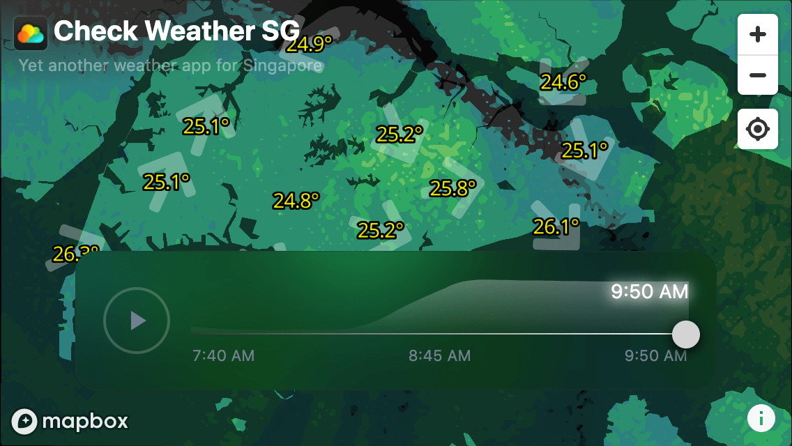

# Check Weather SG

> ☀️🌧 Yet another weather app for Singapore

## Story

### The Beginning

This [began](https://twitter.com/cheeaun/status/982477428713963527) with my long-time curiosity on how to convert raster radar images into vector on a map. I've been using [Weather.gov.sg's Rain Areas map](http://www.weather.gov.sg/weather-rain-area-50km/) whenever it rains, so I thought if I could convert that raster image to be used on [Mapbox GL JS](https://www.mapbox.com/mapbox-gl-js/api/). I could put the whole raster image on Mapbox but choose to make it vector because I like it smoother.

After few trials and errors, I cooked up the [`Rain GeoJSON SG`](https://github.com/cheeaun/rain-geojson-sg) project, a straight-forward API server to convert rain area radar images (Singapore) to GeoJSON.

Since I've gone this far, so I thought "why not?", let's build yet another weather app for Singapore! Thus this project _just happens_.

**👉 Read more: [Building Check Weather SG](http://cheeaun.com/blog/2018/06/building-check-weather-sg/).**

### The lock-down period

2 years later (2020), I [revisited](https://twitter.com/cheeaun/status/1257305456055222273) this project and rebuilt it:

- ⏳ Past 2 hours of radar snapshots
- 🧼 Cleaner UI
- 🗺 Cleaner maps
- 🌏 Remove the 3D mode (it's not useful)

I've also built [an 📱 iOS app](https://github.com/cheeaun/checkweather-sg-native).

And... a plethora of open-source projects to make the impossible possible:

- ☔️ [rain-geojson-sg](https://github.com/cheeaun/rain-geojson-sg) - the core API to fetch weather observations and rain radar
- ⏰ [checkweather-sg-checker](https://github.com/cheeaun/checkweather-sg-checker) - a scheduled serverless function to keep checking for rain
- ⛱ [sg-coverage](https://github.com/cheeaun/sg-coverage) - a script that converts the Singapore boundary into a 217x120 array of indices with values indicating its (land) region excluding the surrounding areas (other countries and water).
- 📸 [rainshot](https://github.com/cheeaun/rainshot) - a serverless instance to capture rain radar images
- 🍩 [rainshot-checker](https://github.com/cheeaun/rainshot-checker) - A site to experiment contouring the radar data
- 📤 [sg-rain-radar-scribbler](https://github.com/cheeaun/sg-rain-radar-scribbler) - another site to load rain radar image and generates a JSON output similar to the one generated by `rain-geojson-sg`.

## Rain notifications

There are currently 3 channels:

1. Push notifications, via [the iOS app](https://github.com/cheeaun/checkweather-sg-native).
2. [Twitter @checkweathersg](https://twitter.com/checkweathersg)
3. [Telegram channel /checkweathersg](https://t.me/checkweathersg)

## Technicalities

[Node.js](https://nodejs.org/en/) is required to run this web app. Here's a list of readily-provided scripts:

- `npm start` - starts a local server
- `npm run build-prod` - build the files for production in `dist` folder

🚧 Due to a bug in the local server ([Parcel](https://parceljs.org/)), loading the local server path (e.g. `http://localhost:1234/`) will return an empty page. Append `/index.html` to the path to see the page.

## Copyright & license

- Data © [Data.gov.sg](https://data.gov.sg/privacy-and-website-terms#site-terms) © [Meteorological Service Singapore](http://www.weather.gov.sg/terms-of-use) © [National Environment Agency](http://www.nea.gov.sg/open-data-licence/)
- Code licensed under [MIT](https://cheeaun.mit-license.org/)
