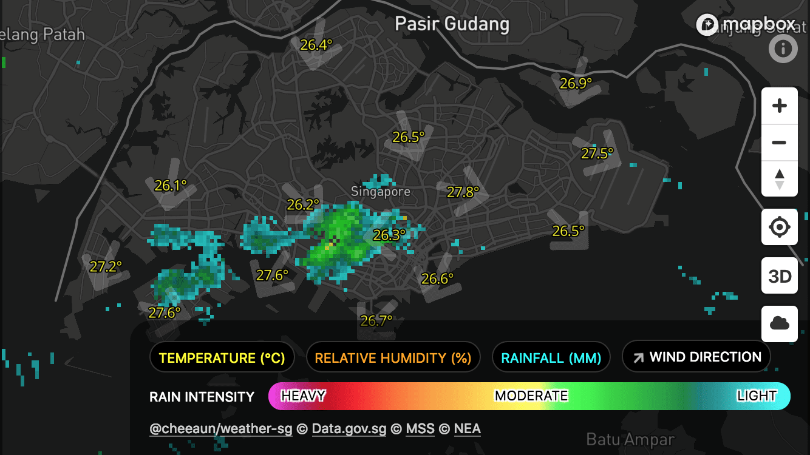
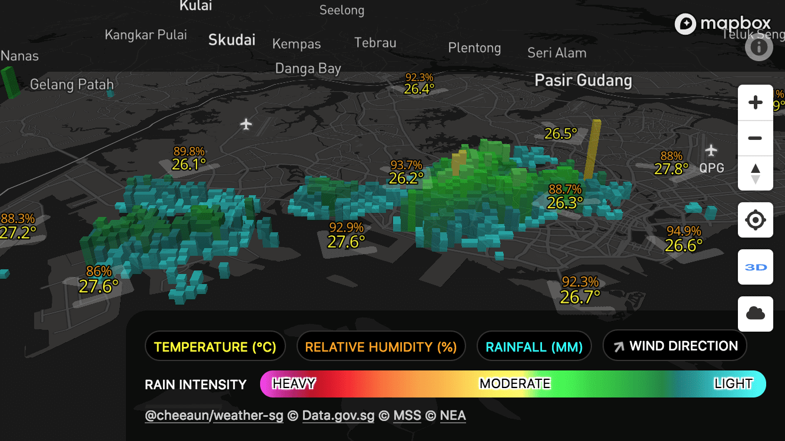
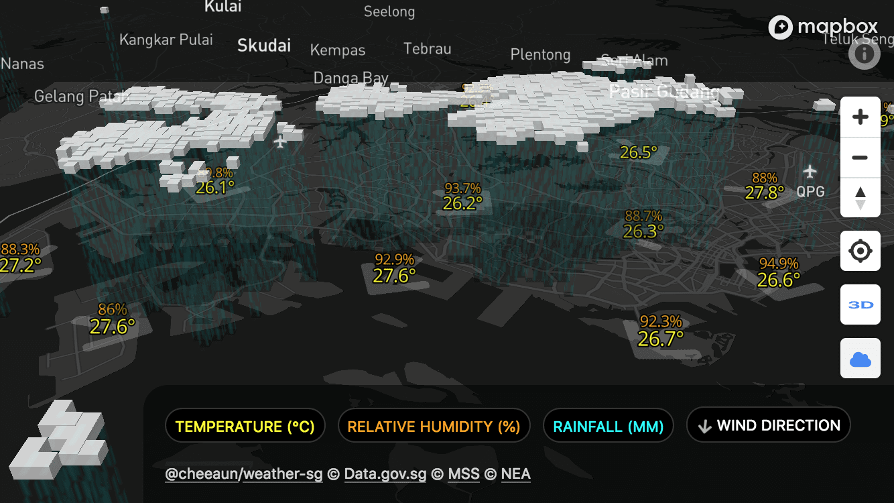

Check Weather SG
===

> ☀️🌧 Yet another weather app for Singapore

Story
---

This [began](https://twitter.com/cheeaun/status/982477428713963527) with my long-time curiosity on how to convert raster radar images into vector on a map. I've been using [Weather.gov.sg's Rain Areas map](http://www.weather.gov.sg/weather-rain-area-50km/) whenever it rains, so I thought if I could convert that raster image to be used on [Mapbox GL JS](https://www.mapbox.com/mapbox-gl-js/api/). I could put the whole raster image on Mapbox but choose to make it vector because I like it smoother.

After few trials and errors, I cooked up the [`Rain GeoJSON SG`](https://github.com/cheeaun/rain-geojson-sg) project, a straight-forward API server to convert rain area radar images (Singapore) to GeoJSON.

Since I've gone this far, so I thought "why not?", let's build yet another weather app for Singapore! Thus this project *just happens*.

**👉 Read more: [Building Check Weather SG](http://cheeaun.com/blog/2018/06/building-check-weather-sg/).**

Technicalities
---

[Node.js](https://nodejs.org/en/) and [Parcel](https://parceljs.org/) are required to run this web app. Here's a list of readily-provided scripts:

- `npm start` - starts a local server
- `npm run build` - build the files for production in `dist` folder

Copyright & license
---

- Data © [Data.gov.sg](https://data.gov.sg/privacy-and-website-terms#site-terms) © [Meteorological Service Singapore](http://www.weather.gov.sg/terms-of-use) © [National Environment Agency](http://www.nea.gov.sg/open-data-licence/)
- Code licensed under [MIT](https://cheeaun.mit-license.org/)
